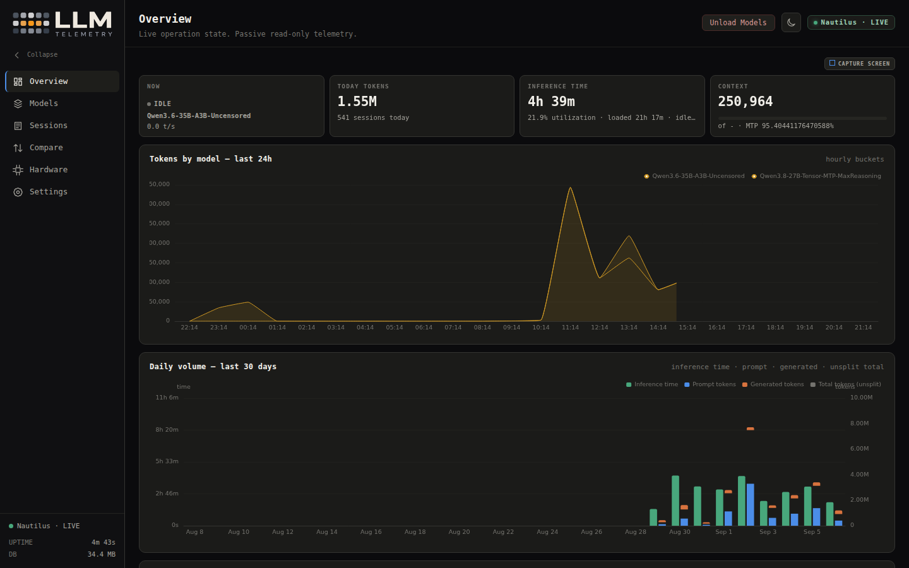

# LLM-Telemetry

> Passive observability dashboard for llama.cpp servers — read-only telemetry, no prompts, no inference control.

[](LICENSE)
[](https://www.python.org/downloads/)
[](https://fastapi.tiangolo.com/)

## What is this?

LLM-Telemetry is a dark-mode dashboard that monitors one or more llama.cpp (or llama.cpp-compatible) inference servers. It polls `/health`, `/metrics`, `/props`, `/v1/models`, and `/slots` — nothing more — and turns the data into dense operational views: which models ran, how they were launched, how MTP behaved, and what the hardware was doing.

**Hard rule:** LLM-Telemetry never sends prompts, triggers inference, loads models, or restarts anything. The only active write is the optional **Unload Models** action, which sends `/models/unload` for each currently loaded model on enabled providers.

> [!WARNING]
> **No authentication.** LLM-Telemetry is designed for trusted closed networks. Do not expose it directly to the public internet; place it behind an authenticated reverse proxy or restrict with firewall/VPN. See [SECURITY.md](SECURITY.md) and [docs/security.md](docs/security.md).

## Why

You have a llama.cpp server running inference. You want to know:

- Which models are doing the work right now?
- How fast are they generating tokens?
- What launch configuration produced these results?
- How much GPU VRAM, power, and temperature did each model consume?
- What are the per-session TTFT, speeds, and context peaks?

LLM-Telemetry answers all of these questions with **passive, read-only** polling. No prompts touch your server.

## Quick start

```bash
# 1. Clone, create venv, install dependencies
git clone https://github.com/acleitao-projects/LLM-Telemetry-Dashboard.git
cd LLM-Telemetry-Dashboard
python3 -m venv .venv && . .venv/bin/activate
pip install -r requirements.txt

# 2. Start in demo mode (no network, synthetic data)
python app.py --demo
```

Open **http://127.0.0.1:8090**

You will see:

```
observatory listening on http://127.0.0.1:8090 (demo)
```

30 days of synthetic history load automatically. Explore the dashboard with real data, no network calls.

### Real mode

When ready for production data:

```bash
python app.py              # reads from your configured providers
```

By default, a provider named **Local llama.cpp** at `http://127.0.0.1:8080` (agent `http://127.0.0.1:8091`) is created on first start. If unreachable, it shows as `STALE`/`OFFLINE`. Add your own providers under **Settings → Providers**.

## Screenshots



## Pages at a glance

| Page | Purpose |
|------|---------|
| [Overview](docs/dashboard-guide.md#overview) | Current slot state, today's tokens/inference/utilization, 24 h activity by model, 7-day leaderboards, recent sessions |
| [Models](docs/dashboard-guide.md#models) | Group-by-family ranking table with activity state, sparklines, and a selected-model panel showing live runtime snapshot |
| [Model Detail](docs/dashboard-guide.md#model-detail) | Time accounting (prompt / generation / idle), token buckets, prompt vs generation speed, context, MTP acceptance, full config history |
| [Sessions](docs/dashboard-guide.md#sessions) | Externally driven inference sessions detected passively from slot/task identity; filter by provider, model, quant, MTP, reasoning effort |
| [Session Detail](docs/dashboard-guide.md#session-detail) | TTFT, speeds, peaks, context peak, MTP acceptance, hardware averages, per-second series |
| [Compare](docs/dashboard-guide.md#compare) | Line up to five observed model files side by side across a shared time range; export as shareable PNG |
| [Hardware](docs/dashboard-guide.md#hardware) | CPU/RAM/GPU/PCIe host facts, llama.cpp build version, per-GPU utilization/VRAM/temperature/power series |
| [Settings](docs/dashboard-guide.md#settings) | Provider CRUD with connection test, display defaults, per-model pricing, a secondary display currency, and opt-in automatic pricing sync |

## Key features

- **Passive, read-only telemetry** — polls `/health`, `/metrics`, `/props`, `/v1/models`, `/slots`; never sends prompts
- **Multiple providers** — connect to several llama.cpp or compatible servers simultaneously
- **Model-family grouping** — roll quantizations of the same model together; group by Family, Each file, or Quant
- **Time ranges** — Today, 2d, 3d, 5d, 7d, 30d, or All
- **Session tracking** — detects externally driven inference sessions from slot/task identity with provisional live progress
- **Counter-reset handling** — server restarts close sessions, re-anchor baselines, no negative deltas
- **MTP tracking** — proposed/accepted rates and acceptance percentage
- **Config history** — every distinct launch config observed, kept forever
- **Model pricing** — exact-decimal input/output prices; optional secondary display currency (FX refresh, display-only)
- **Automatic pricing** — opt-in background worker matches models to a public catalog and writes prices; never prompts your models
- **Compare screen** — side-by-side model comparison with exportable PNG
- **Hardware telemetry** — CPU, RAM, per-GPU utilization/VRAM/temperature/power via optional host agent
- **Three-tier retention** — 2 h raw samples → 7 d minute buckets → 30 d hourly buckets; models/configs/hardware/sessions never pruned
- **Single-writer lease** — renewable SQLite lease permits only one collector per database; additional processes stay read-only
- **Demo mode** — `--demo` flag seeds 30 days of synthetic history and keeps producing live synthetic activity
- **Screenshot capture** — embed page captures in documentation via `/api/screenshots/` endpoint
- **Live SSE updates** — real-time snapshot broadcast at 1-second intervals

## Stack

- **Backend:** FastAPI, uvicorn, SQLModel (SQLite), Jinja2
- **Frontend:** ECharts (vendored, no CDN), vanilla JavaScript, CSS with dark/light themes
- **Deployment:** run directly or under systemd (see [docs/installation.md](docs/installation.md))
- No frontend build step

## Documentation

| Guide | Description |
|-------|-------------|
| [Getting Started](docs/getting-started.md) | Zero-to-visible-telemetry walkthrough |
| [Installation](docs/installation.md) | Local dev and running as a systemd service |
| [Configuration](docs/configuration.md) | All settings, providers, demo mode, retention |
| [Providers](docs/providers.md) | llama.cpp integration, agent setup, connectivity |
| [Dashboard Guide](docs/dashboard-guide.md) | Every screen with screenshots |
| [Architecture](docs/architecture.md) | Component diagram, data flow, collector lifecycle |
| [Operations](docs/operations.md) | Startup, shutdown, health checks, backups, logging |
| [Upgrading](docs/upgrading.md) | Safe update procedure, schema migration |
| [Troubleshooting](docs/troubleshooting.md) | Common problems and diagnostics |
| [Security](docs/security.md) | Trusted-network assumptions, exposure risks |

## License

0BSD — see [LICENSE](LICENSE). Do whatever you want; no attribution required.
