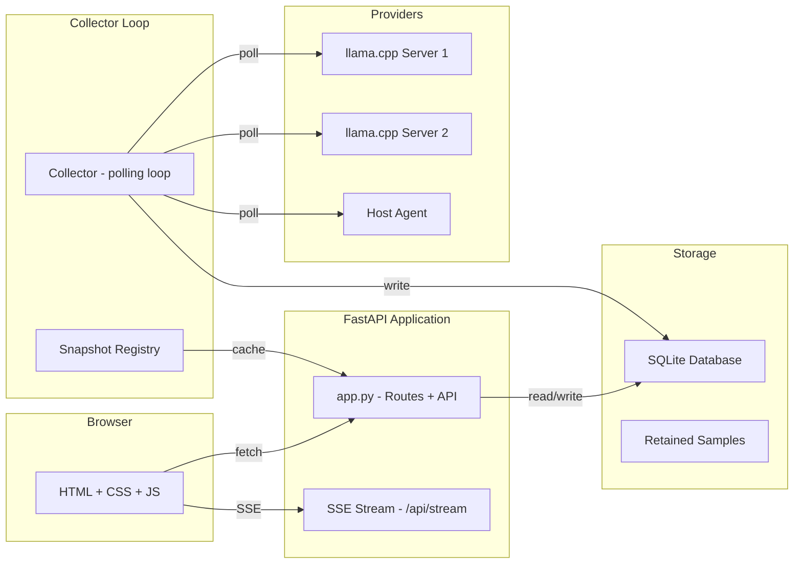

# Architecture

This document describes the internal architecture of LLM-Telemetry, grounded in the current codebase.

## Component overview

## High-level data flow

1. **Collector loop** (background thread) iterates over all enabled providers
2. For each provider, polls `/health`, `/metrics`, `/props`, `/v1/models`, `/slots`
3. Parses Prometheus-format metrics and maps them to internal metric names
4. Computes counter deltas and stores telemetry samples in SQLite
5. Detects sessions from slot/task identity changes
6. Updates usage buckets and residency intervals
7. Runs retention sweep to downsample old data
8. **API layer** serves aggregated queries from the database
9. **Frontend** fetches API endpoints and renders ECharts visualizations
10. **SSE endpoint** broadcasts a 1-second live snapshot to all connected clients

## Application layer (`app.py`)

The FastAPI application provides two types of endpoints:

### Page routes

- `/` — redirects to `/overview`
- `/overview`, `/models`, `/models?mid={id}`, `/sessions`, `/session/{id}`, `/compare`, `/hardware`, `/settings`
- Each renders `base.html` with the appropriate template injected

### API routes

| Route | Method | Purpose |
|-------|--------|---------|
| `/api/meta` | GET | Provider list, display settings, snapshot cache stats |
| `/api/overview` | GET | Cached overview data with stale-while-revalidate |
| `/api/models` | GET | Models page data (grouped ranking with sparklines) |
| `/api/models/sparks` | GET | Sparkline data for model ranking |
| `/api/models/unload-all` | POST | Unload all loaded models on all enabled providers |
| `/api/models/selected` | GET | Stats for selected models |
| `/api/model/{id}` | GET | Single model detail data |
| `/api/sessions` | GET | Filterable session list |
| `/api/session/{id}` | GET | Single session detail |
| `/api/compare` | GET | Compare data for selected models |
| `/api/compare/candidates` | GET | Available sessions for comparison |
| `/api/compare/models/candidates` | GET | Available models for comparison |
| `/api/compare/models` | GET | Compare data for selected model keys |
| `/api/compare/models/gpus` | GET | GPU data for compare view |
| `/api/hardware` | GET | Hardware + GPU telemetry |
| `/api/status` | GET | System status per metric group |
| `/api/stream` | SSE | Live snapshot broadcast (1s interval) |
| `/api/settings/providers` | CRUD | Provider management |
| `/api/settings/display` | GET/PUT | Display settings |
| `/api/settings/models` | GET | Provider model list with pricing |
| `/api/settings/model-pricing` | PUT | Update model pricing |
| `/api/screenshots/{id}` | PUT | Save screenshot capture |
| `/screenshots/{id}.png` | GET | Serve saved screenshot |
| `/screenshots/{id}/wait` | GET | Wait for screenshot to be saved |

## Collector loop (`observatory/collector.py`)

The collector is the heart of the data pipeline. It runs as a background thread with these responsibilities:

### Lease management

- Uses a renewable SQLite lease pattern (`CollectorLease` table)
- Only one collector can be the writer per database
- Other collector processes become read-only and take over if the writer lease becomes stale

### Polling cycle

1. For each enabled provider, send concurrent HTTP requests to all endpoints
2. Parse metrics responses using the metric alias system
3. Compute counter deltas (positive-only; counter resets create new baselines)
4. Store telemetry samples in SQLite
5. Track session start/end from slot/task identity changes
6. Update usage buckets (minute-level aggregates)
7. Update model residency intervals (load/unload tracking)

### Session detection

Sessions are detected passively from llama.cpp slot/task identity:

1. When `/slots` reports a task on a slot that wasn't processing → session start
2. When a slot's task completes or the task disappears → session end (after `SESSION_END_DELAY_S` grace period)
3. Large gaps between samples (`SAMPLE_DT_MAX_S`) close a session first

### Counter reset handling

When a counter decreases between consecutive samples:

1. The delta is treated as zero (new baseline)
2. The model's state is reset
3. A new session begins if the model is loaded

## Database (`observatory/database.py`)

### Schema version

Current schema version: **v14** (tracked in `meta.schema_version`).

### Tables

| Table | Purpose |
|-------|---------|
| `provider` | Inference server configuration and status |
| `model` | Observed model files |
| `modelconfig` | Distinct launch configurations |
| `buildinfo` | llama.cpp build/version history |
| `hardwareinfo` | Host GPU/PCIe facts |
| `telemetrysample` | Per-model, per-timestamp observations |
| `gputelemetrysample` | Per-GPU observations from host agent |
| `session` | Detected inference sessions |
| `modelusagebucket` | Minute-level usage aggregates |
| `modelresidency` | Model load/unload intervals |
| `collectorlease` | Single-writer lease |
| `setting` | Key-value settings storage |
| `meta` | Schema version metadata |

### Migrations

Migrations are forward-only and additive. They run on every app startup:

- v1→v2: Clean empty build info
- v1→v3: Add `prompt_seconds_total` and `gen_seconds_total` columns
- v1→v4: Add session metadata columns (source_slot_id, live fields, result_source)
- v1→v5: Add live TPS fields to sessions
- v1→v6: Add live_context_max to sessions
- v1→v7: Add indexes on telemetrysample and gputelemetrysample
- v1→v8: Add session indexes
- v1→v9: Add model+timestamp index on telemetrysample
- v1→v10: Add session status+seen_at index
- v1→v11: Add session provider+end index
- v1→v12: Add usage buckets + residency intervals (G02), backfill historical data
- v1→v13: Add catalog availability + pricing columns (G03)
- v1→v14: Add covering index on usage buckets (P02)

## Snapshot caching (`observatory/snapshot.py`)

The SnapshotRegistry implements single-flight, stale-while-revalidate caching:

1. **Single-flight**: Only one cache refresh runs per (provider, range) key at a time
2. **Stale-while-revalidate**: If cached data is older than `revalidate_s` (5s), a background refresh starts but stale data is returned immediately
3. **Data versioning**: Cache invalidation triggers on changes to the data generation counter

## Frontend architecture

### JavaScript modules

| File | Purpose |
|------|---------|
| `static/js/app.js` | Main application logic: page init, chart management, SSE updates, screenshot capture, theme toggle |
| `static/js/charts.js` | Shared helpers: formatters (`fmtTokens`, `fmtDur`, `fmtTps`, `fmtPct`, `fmtNum`, `fmtClock`, `fmtDate`, `fmtAgo`), `el()` DOM helper, `api()` deduplicated fetch |
| `static/js/chart-runtime.js` | Chart lifecycle registry: bounded Map-backed ChartRegistry, init/update/dispose pattern, stable series IDs, in-place `setOption` updates |
| `static/js/echarts.min.js` | Vendored Apache ECharts library (no CDN dependency) |

### Template structure

- `templates/base.html` — master template with sidebar navigation, topbar, mobile menu, theme toggle, conditional chart script loading
- Individual page templates (`overview.html`, `models.html`, etc.) — page-specific HTML structure injected into base template

### Live updates

The `/api/stream` SSE endpoint broadcasts a live snapshot every 1 second. The frontend uses EventSource to receive updates and reconciles new data against existing chart state using the ChartRegistry's stable series ID system.

## Retention system

The retention sweep runs every 5 minutes (`RETENTION_SWEEP_S`):

| Tier | Content | Retention |
|------|---------|-----------|
| Raw | Per-sample telemetry | 2 hours |
| Mid | 10-second aggregated buckets | 7 days |
| Full | 60-second aggregated buckets | 30 days |

**Never pruned:** models, configs, builds, hardware info, sessions, usage buckets, residency intervals.

## Demo mode

Demo mode (`--demo` flag) replaces the real provider client with `FakeClient` from `observatory/demo.py`:

1. Seeds 30 days of synthetic history with 6 model specs across 4 families
2. Includes MTP-enabled models and multiple launch configs
3. Includes hardware and build info
4. Runs the real collector loop against the fake client
5. Uses a separate database (`data/observatory_demo.db`)

The fake client simulates realistic phase transitions (idle → loading → prompting → generating → idle) with randomized timing and values.
