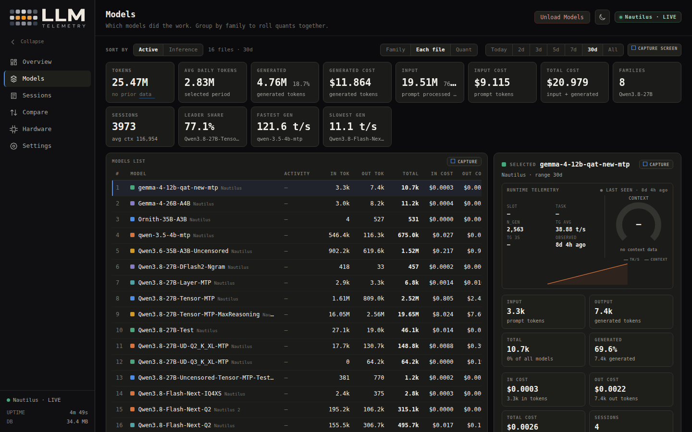
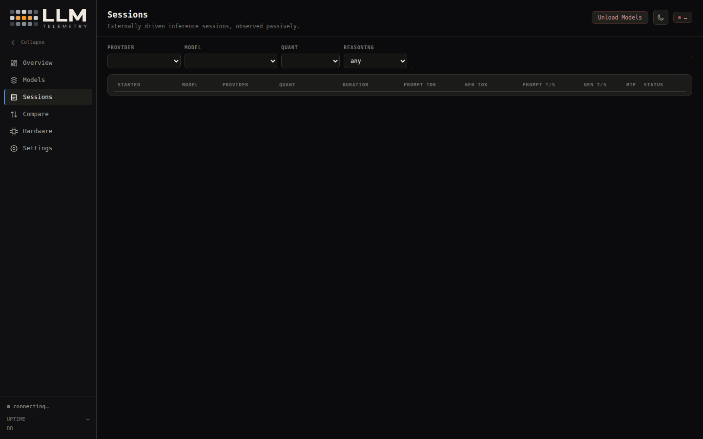
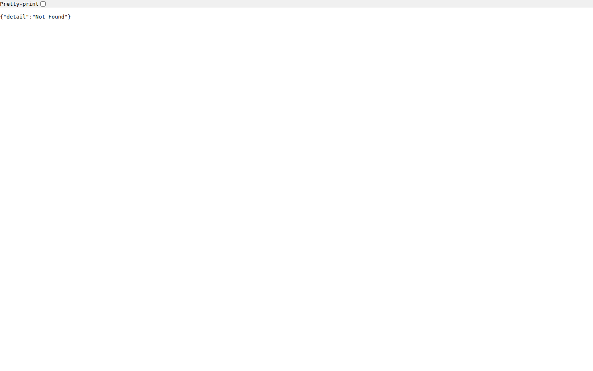
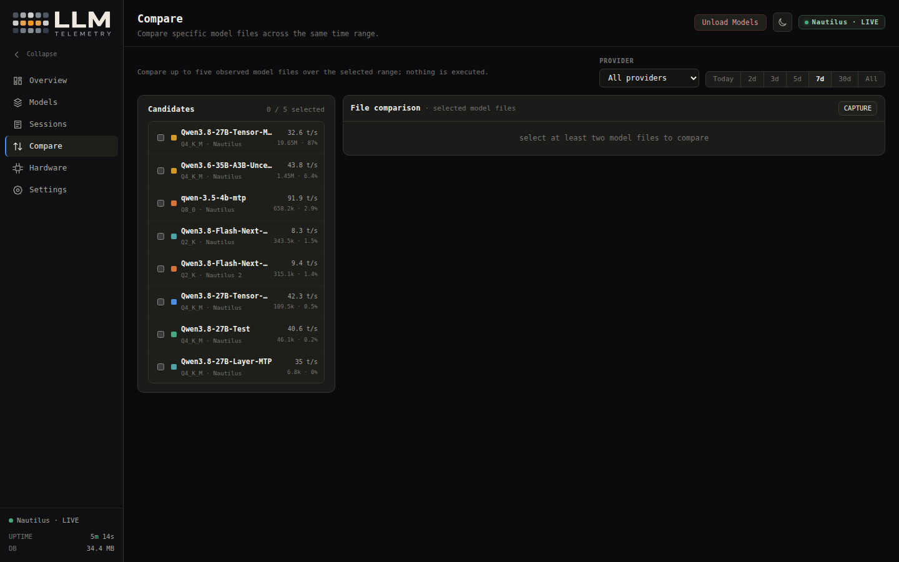
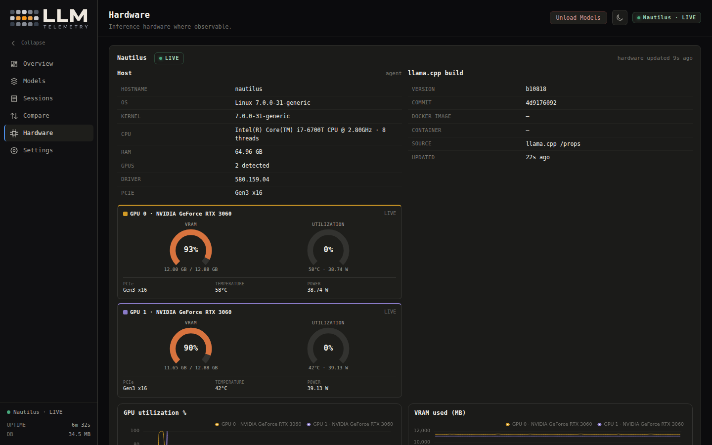
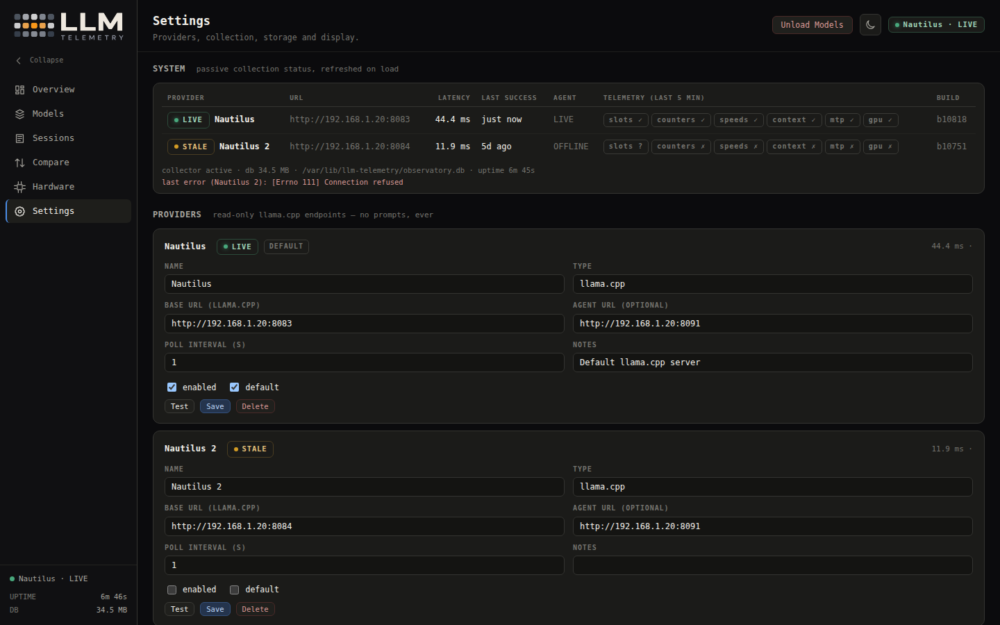

# Dashboard Guide

Every screen in LLM-Telemetry with screenshots and detailed explanations.

## Overview

The Overview page provides a real-time snapshot of current operations.

### What it shows

- **Current state card** — the busiest slot's state badge (UNLOADED / LOADING / IDLE / PROMPTING / GENERATING), tokens/second, context window usage, and MTP status
- **Metric strip** — today's total tokens, inference time, and model utilization percentage
- **24-hour token activity** — bar chart showing token generation by model over the last 24 hours
- **7-day inference-time leaders** — top models ranked by total inference time over the past week
- **7-day token leaders** — top models ranked by total tokens over the past week
- **Recent sessions** — list of the most recently completed sessions with key metrics

### Live behavior

The Overview page receives live updates via SSE (Server-Sent Events) at 1-second intervals. The current state card refreshes as new telemetry arrives. The 24-hour chart updates every 7 seconds.

---

## Models

The Models page is the workhorse of the dashboard. It shows which models did work, grouped for comparison.

### Grouping modes

- **Family** — rolls quantizations of the same model together (e.g., all Qwen3.8-27B variants)
- **Each file** — shows every model file separately
- **Quant** — groups by quantization level (Q4_K_M, IQ4_XS, etc.)

### Time ranges

| Range | Description |
|-------|-------------|
| Today | Only today's data |
| 2d, 3d, 5d, 7d | Rolling window |
| 30d | Last 30 days |
| All | All available data |

### What the table shows

| Column | Description |
|--------|-------------|
| Rank | Position in the ranking (by active time by default) |
| Model | Model name with family/quant info |
| Active time | Total time models were processing (prompting + generating) |
| Inference time | Total time spent in inference (prompting + generation) |
| Loaded time | Total time models were loaded |
| Idle time | Total time models were loaded but idle |
| Sparklines | Mini-charts showing usage pattern over the range |
| Activity state | Color-coded badge showing last known state |

### Selected model panel

Click a model row to open the detail panel showing:

- **Live runtime snapshot** — current generation tokens, prompt tokens, rolling 3-second generation TPS, and an orange context gauge
- **Historical totals** — authoritative accumulated counts from the database
- **Time accounting chart** — stacked bar showing prompt, generation, and idle time relative to loaded time

---

## Model Detail

The Model Detail page shows deep telemetry for a single model file.

### Sections

- **Live state** — current runtime state, TPS, context usage
- **Time accounting** — stacked chart: prompt time + generation time on top of loaded time
- **Token buckets** — distribution of input/output/unclassified tokens
- **Prompt vs generation speed** — comparison of prompt TPS and generation TPS over time
- **Context** — context window usage over the selected range
- **MTP acceptance** — proposed vs accepted speculative tokens (if MTP is enabled)
- **Hardware** — GPU utilization, VRAM, temperature, power averages
- **Launch configuration** — the full observed launch config with **Full launch flags** dump
- **Config history** — every distinct launch configuration observed, kept forever

### Important notes

- Config history preserves every unique launch configuration. If a model is restarted with different flags, a new config row is added.
- The "Full launch flags" section shows the raw argv array from the llama.cpp process.

---

## Sessions

The Sessions page lists externally driven inference sessions detected passively from llama.cpp slot/task identity.

### Filters

| Filter | Description |
|--------|-------------|
| Provider | Filter by specific provider |
| Model | Filter by specific model |
| Quant | Filter by quantization level |
| MTP | Filter by MTP on/off |
| Reasoning effort | Filter by reasoning effort level |
| Range | Time range for displayed sessions |

### Session states

| State | Description |
|-------|-------------|
| ACTIVE | Currently in progress (live) |
| FINALIZING | Session ended, collecting final data |
| CLOSED | Session completed with full data |
| INTERRUPTED | Session cut short (e.g., server restart) |
| INCOMPLETE | Session with missing data |

### Session columns

| Column | Description |
|--------|-------------|
| Start time | Session start timestamp |
| Duration | Total session duration |
| Prompt tokens | Tokens sent to the model |
| Gen tokens | Tokens generated by the model |
| Prompt TPS | Average prompt processing speed |
| Gen TPS | Average generation speed |
| TTFT | Time to first token |
| Status | Session completion state |

---

## Session Detail

The Session Detail page shows per-second telemetry for a single session.

### What it shows

- **TTFT** — time to first token
- **Prompt statistics** — tokens, TPS, duration
- **Generation statistics** — tokens, average TPS, peak TPS, duration
- **Context peak** — maximum context window usage
- **MTP metrics** — proposed/accepted tokens and acceptance rate (if enabled)
- **Hardware averages** — GPU utilization, VRAM, temperature, power during the session
- **Per-second series** — granular chart showing prompt TPS, generation TPS, context, GPU utilization over the session duration
- **Launch config** — the configuration that this session ran with

### Interpretation

- **TTFT > 2s** may indicate long prompt processing or server load
- **Peak gen TPS >> avg gen TPS** suggests burst generation patterns
- **GPU util < 50% during generation** may indicate CPU-bound prompt processing or model architecture limitations

---

## Compare

The Compare page lines up to five specific observed model files side by side across a shared time range.

### How to use

1. Select models to compare from the candidate list (left rail)
2. Choose a shared time range
3. Review the comparison data tables and charts
4. Export as PNG using the capture button

### What's compared

| Metric | Description |
|--------|-------------|
| Total tokens | Prompt + generation tokens |
| Prompt TPS | Average prompt processing speed |
| Generation TPS | Average generation speed |
| TTFT | Time to first token |
| Context peak | Maximum context usage |
| MTP acceptance | Speculative token acceptance rate |
| Hardware | Average GPU utilization and VRAM |

### Export

The **Export PNG** button captures the comparison view as a shareable image. The screenshot is saved via the `/api/screenshots/` endpoint and can be downloaded from the browser.

---

## Hardware

The Hardware page shows host-level facts and per-GPU telemetry.

### Host section

Displays:
- **CPU model** and thread count
- **RAM** total and used
- **GPU** list with VRAM
- **Driver** version (NVIDIA) and CUDA version
- **PCIe** generation and lanes

### Build info

Shows the authoritative llama.cpp build version and commit from `/props`, plus Docker image and container ID if running in a container.

### Per-GPU charts

For each GPU, the following time series are shown (1-hour window):

- **GPU utilization** — percentage of time the GPU was active
- **VRAM used** — megabytes of VRAM in use
- **Temperature** — GPU temperature in Celsius
- **Power** — GPU power draw in watts

### Requirements

Hardware telemetry requires the host agent (`host_agent.py`). Without it, only GPU info from the llama.cpp server is available.

---

## Settings

The Settings page manages providers, display defaults, and model pricing.

### System Status

Shows telemetry availability per metric group:

- **Counters** — `tokens_total`, `prompt_total`, `gen_total`
- **Speeds** — `gen_tps`, `prompt_tps`
- **Context** — `context_used`, `context_max`
- **MTP** — `mtp_proposed_total`, `mtp_accepted_total`, `mtp_avg_acc`
- **GPU** — `gpu_util`, `vram_used_mb`

Each group displays a status indicator (green = live data, gray = no data).

### Provider management

- **List** — all configured providers with status indicators
- **Add** — create a new provider
- **Edit** — modify provider settings
- **Test** — passive connection test against all endpoints
- **Delete** — remove a provider
- **Enable/Disable** — toggle without deleting

### Display settings

- **Default range** — default time range for Models/Sessions pages
- **Default group** — default grouping mode on Models page
- **Theme** — dark or light mode

### Model pricing

Select a provider to see its models and set per-model pricing:

- **Input price per million tokens** — cost per million input tokens
- **Output price per million tokens** — cost per million output tokens

Prices are stored as Decimal strings and validated (non-negative, max 8 decimal places).

---

## Navigation sidebar

The sidebar provides quick access to all pages:

| Page | Path |
|------|------|
| Overview | `/overview` |
| Models | `/models` |
| Sessions | `/sessions` |
| Compare | `/compare` |
| Hardware | `/hardware` |
| Settings | `/settings` |

The sidebar collapses on narrow viewports (< 800px) and becomes a hamburger menu. The theme toggle (sun/moon icon) switches between dark and light modes.
